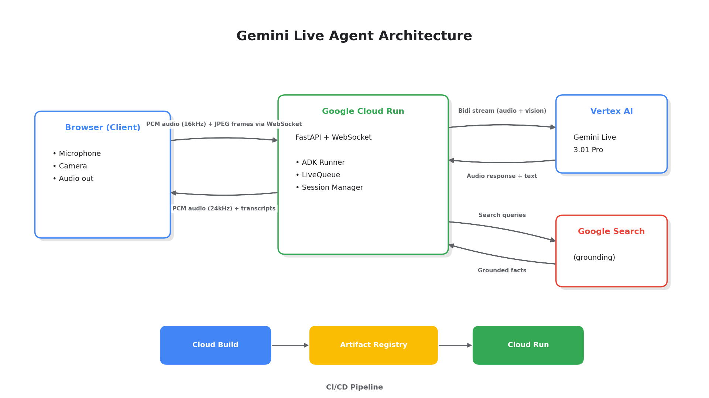

# Aria — Gemini Live Agent

> A real-time AI assistant that sees through your camera, listens to your voice, handles interruptions, and never hallucinates.

## Demo

**Live Demo:** [Deploy to Google Cloud Run following the instructions below to get your live URL!]

## What it does
- **Voice Interaction:** Engage in natural, full-duplex conversations. Aria understands vocal intent, responds within 1-2 seconds with high-quality synthesized speech, and gracefully handles rapid interruptions using Voice Activity Detection (VAD).
- **Computer Vision:** Aria sees what you see. By securely streaming Base64-encoded camera frames via WebSockets, the agent dynamically analyzes physical environments and answers contextual visual queries in real-time.
- **Search Grounding:** Never worry about AI hallucinations. The agent relies heavily on the `google_search` tool through Google ADK to verify current facts before speaking, ensuring highly reliable, grounded responses.

## Architecture


**Data Flow:**
The architecture relies on a fast, lightweight FastAPI server managing full-duplex WebSocket connections from multiple concurrent web clients. The browser dynamically captures audio via the `MediaDevices` API, converts it into 16kHz PCM integer arrays, applies Voice Activity Detection (VAD) via RMS calculations locally to reduce bandwidth, and streams the binary payloads straight to the backend. Concurrently, it captures hardware camera context and sends 2 FPS Base64 JPEG payloads as supplementary context. 

On the backend, a `SessionManager` securely orchestrates Google ADK runners. These runners bridge the gap between our raw WebSocket sockets and Vertex AI’s bleeding-edge streaming infrastructure (`gemini-3.1-pro-preview`). We utilize `StreamingMode.BIDI` for maximum throughput. As the agent dynamically searches Google for facts (via injected Tools), streams response tokens, synthesizes audio output on the fly, and routes those synthesized 24kHz PCM blocks back down to the browser. The browser seamlessly concatenates and plays gaps out using a custom Web Audio API floating-point scheduler. The entire backend application is containerized within Docker and deployed auto-scaling to Google Cloud Run. 

## Tech Stack
| Layer | Technology |
| --- | --- |
| **Frontend** | Vanilla HTML/CSS/JS, Web Audio API, MediaDevices API |
| **Backend** | Python 3.11, FastAPI, WebSockets (`uvicorn`) |
| **AI Agent** | Google ADK, Gemini Live API (Audio/Vision modality) |
| **Production AI** | Vertex AI (`gemini-3.1-pro-preview`) |
| **Deployment** | Docker, Google Cloud Build, Google Cloud Run |
| **Grounding** | Google Search via ADK Tool integrations |

## Prerequisites
- **Python 3.11+** installed locally
- A **Google Cloud Project** with active billing enabled
- The `gcloud` CLI installed and authenticated to your profile
- A valid Google API key with Gemini access

## Local Setup

1. **Clone the repository and enter the directory**
   ```bash
   git clone <your-repo>
   cd gemini-live-agent
   ```

2. **Install dependencies**
   ```bash
   pip install -r backend/requirements.txt
   ```

3. **Configure Environment Variables**
   Update `backend/.env` with your Google credentials:
   ```env
   GOOGLE_API_KEY=your_genai_api_key_here
   GOOGLE_CLOUD_PROJECT=your_project_id
   GOOGLE_CLOUD_LOCATION=us-central1
   GOOGLE_GENAI_USE_VERTEXAI=FALSE
   ```

4. **Run the local backend server**
   ```bash
   cd backend
   uvicorn main:app --reload --port 8000
   ```

5. **Interact**
   Open your browser to the local UI hosted at: `http://localhost:8000`

## Cloud Deployment

A robust `deploy.sh` script is provided to automate Cloud Build and Artifact Registry provisioning.

**1. Set project context and authenticate**
```bash
gcloud auth login
gcloud config set project YOUR_PROJECT_ID
```

**2. Enable core cloud APIs (Run, Build, AIPlatform, Artifacts)**
```bash
gcloud services enable run.googleapis.com aiplatform.googleapis.com cloudbuild.googleapis.com artifactregistry.googleapis.com
```

**3. Build and Deploy**
Execute the provided shell orchestrator:
```bash
chmod +x deploy.sh
./deploy.sh
```
*Behind the scenes, this creates the Docker repository `gemini-live-agent`, submits `cloudbuild.yaml` to Google Cloud Build, spins up an isolated Cloud Run revision, injects production environment variables, and spits out the public HTTPS URL.*

## How to Test
**Automated Local Testing:**
If the local server is running, you can run the headless test script to simulate Voice/Image injection and assert WebSocket frame sanity:
```bash
python backend/test_local.py
```

**Manual Validation:**
1. Ping the health endpoint: `curl https://<YOUR-CLOUD-RUN-URL>/health`
2. Open the main URL in any Chromium/Webkit browser: `https://<YOUR-CLOUD-RUN-URL>`
3. Click "Start" -> allow Mic/Camera permissions. 
4. Ask Aria a complex question about an active event (Testing ground search) or hold up a physical object to the camera and ask "What do you see?" (Testing Multi-Modal Vision).

## Hackathon Notes
- **Submitted to:** Gemini Live Agent Challenge (Devpost)
- **Category:** Live Agents
- **Built with:** Google ADK, Gemini Live API, Cloud Run Architectures

## License
Apache 2.0
